<p align="center">
    
</p>

# Tatum SDK for PHP
{: .fs-9 }

A flexible framework to build, run, and scale blockchain apps with PHP
{: .fs-6 .fw-300 }

[Install with Composer](https://packagist.org/packages/tatumio/tatum-php){: .btn .btn-primary .fs-5 .mb-4 .mb-md-0 .mr-2 }
[Clone from GitHub](https://github.com/tatumio/tatum-php){: .btn .fs-5 .mb-4 .mb-md-0 }

---

The Tatum SDK uses a [fluent interface](https://en.wikipedia.org/wiki/Fluent_interface) so that you can jump right into 
building your application without having to go back to the documentation.

```mermaid
stateDiagram-v2
    label: Tatum PHP SDK 💦 Fluent Interface

    state label {
        sdk: new Sdk ( API-KEY-MAINNET, API-KEY-TESTNET )
        [*] --> sdk
        sdk --> testnet()
        sdk --> mainnet()

        state testnet() {
            [*] --> config()
            [*] --> local()
            [*] --> api()
            local() --> wallet()
            local() --> transaction()
        }

        state mainnet() {
            mConfig(): config()
            mLocal(): local()
            mApi(): api()
            mWallet(): wallet()
            mTransaction(): transaction()

            [*] --> mConfig()
            [*] --> mLocal()
            [*] --> mApi()
            mLocal() --> mWallet()
            mLocal() --> mTransaction()
        }
    }
```



The SDK is built like a tree with its root in ```new \Tatum\Sdk()```. 

Tree branches are populated as needed just-in-time so the memory footprint is tiny.

## Table of Contents
- [Installation & Usage](#installation--usage)
  - [Requirements](#requirements)
- [Getting Started](#getting-started)
  - [Examples](#examples)
  - [Tests](#tests)
  - [Configuration](#configuration)
  - [Debugging](#debugging)
    - [Enable debugging](#enable-debugging)
    - [Change output location](#change-output-location)
    - [Disable sanitizer](#disable-sanitizer)
    - [Example output](#example-output)

## Installation & Usage

To install the Tatum SDK, simply clone this repository and load it with a [PSR-4](https://www.php-fig.org/psr/psr-4/) autoloader.
If you're having doubts, you can use the provided `autoload.php` file.

You can also install the latest version of `Tatum PHP SDK` by issuing the following command:

```
composer require tatumio/tatum-php
```

This SDK has no external dependencies in production. This means you can use this library in any PHP project even when you don't have access to Composer.

### Requirements

This SDK requires `64-bit` `PHP 7.3` or later with the following extensions:

 * `ext-curl`
 * `ext-json`
 * `ext-gmp`
 * `ext-bcmath`
 * `ext-mbstring`

Supported PHP [Versions](https://www.php.net/supported-versions.php): `7.3`, `7.4`, `8.0`, `8.1`, `8.2`.

## Getting Started

Please follow the [installation procedure](#installation--usage) then create an entrypoint PHP file with the following:

```php
<?php

// Import a PSR-4 autoloader
require_once(__DIR__ . '/autoload.php');

// Set your API Keys 👇 here
$sdk = new \Tatum\Sdk();

try {
    /** @var $walletTestnet \Tatum\Model\Wallet */
    $walletTestnet = $sdk
        ->testnet()
        ->api()
        ->bitcoin()
        ->btcGenerateWallet();

    /** @var $walletTestnetLocal \Tatum\Model\Wallet */
    $walletTestnetLocal = $sdk
        ->testnet()
        ->local()
        ->wallet()
        ->bitcoin()
        ->generateWallet($walletTestnet->getMnemonic());

    /** @var $walletMainnet \Tatum\Model\Wallet */
    $walletMainnet = $sdk
        ->mainnet()
        ->api()
        ->bitcoin()
        ->btcGenerateWallet();

    /** @var $walletMainnetLocal \Tatum\Model\Wallet */
    $walletMainnetLocal = $sdk
        ->mainnet()
        ->local()
        ->wallet()
        ->bitcoin()
        ->generateWallet($walletMainnet->getMnemonic());

    // Get the extended public key
    var_dump("TestNet", $walletTestnet->getXpub(), $walletTestnetLocal->getXpub());
    echo PHP_EOL;
    var_dump("MainNet", $walletMainnet->getXpub(), $walletMainnetLocal->getXpub());

} catch (\Tatum\Sdk\ApiException $apiExc) {
    echo "API Exception when calling bitcoin()->btcGenerateWallet(): ",
        var_export($apiExc->getResponseBody(), true),
        PHP_EOL;
} catch (\Exception $exc) {
    echo "Exception when calling bitcoin()->btcGenerateWallet(): " . $exc->getMessage() . PHP_EOL;
}
```

Please note that both **api keys** are optional when creating a new instance of `\Tatum\Sdk()`.

If you don't provide an API key, a new one is generated automatically for you based on your IP address.

> Please note that some parts of the API require using your own API key with either a free or paid plan.

### Examples

To run the examples, use:

```bash
php -f ./examples/{path-to-example-file}.php
```

For security reasons you cannot execute these files from a server request.

### Tests

To run the unit tests, use:

```bash
composer install
vendor/bin/phpunit
```

### Configuration

MainNet and TestNet operations have their own configuration object:

```php
// Set your API Keys 👇 here
$sdk = new \Tatum\Sdk();

// MainNet Configuration
$sdk->mainnet()->config();

// TestNet Configuration
$sdk->testnet()->config();
```

You can fetch the following:

  * [Debugging](#debugging) tools
  * `getApiKey()`: Your [Tatum API key](https://dashboard.tatum.io)
  * `getTempFolderPath()`: Path for storing downloaded files
  * `getUserAgent()`: Request header for API calls
  * `getHost()`: API server domain
  * `getVersions()` - array containing:
    * Operating System version
    * PHP version
    * OpenAPI specification version
    * SDK version

You can change the following:

  * [Debugging](#debugging) tools
  * `setApiKey()`: Note - set the API key for the current network type!
  * `setTempFolderPath()`

### Debugging

The debugger allows you to get detailed information on API requests made by the SDK.

#### Enable debugging

Debugging is disabled by default but you can enable it with ease:

```php
// Set your API Keys 👇 here
$sdk = new \Tatum\Sdk();

// Enable debugging on MainNet
$sdk->mainnet()->config()->setDebug(true);

// Enable debugging on TestNet
$sdk->testnet()->config()->setDebug(true);
```

Notice that the debugger functionality is strictly tied to your `$sdk` instance and you can have
different debugger behaviors on the mainnet and testnet.

#### Change output location

If you have enabled debugging, additional information will be written to the specified location.

By default, the write location for the `debugger` is your standard CLI output, or `php://output`.

You can redirect the output of the debugger to any other file:

```php
// Set your API Keys 👇 here
$sdk = new \Tatum\Sdk();

// Set debug output on MainNet
$sdk->mainnet()->config()->setDebugFile('/path/to/file.log');

// Set debug output on TestNet
$sdk->testnet()->config()->setDebugFile('/path/to/file.log');
```

#### Disable sanitizer

By default, sensitive values like `x-api-key`, `private key` and `mnemonic` are partially obfuscated.
You can disable this functionality for local testing only.

**WARNING**: Never share logs that were produced with the `debug sanitizer` turned off!

```php
// Set your API Keys 👇 here
$sdk = new \Tatum\Sdk();

// Disable debug sanitizer on MainNet
$sdk->mainnet()->config()->setDebugSanitizer(false);

// Disable debug sanitizer on TestNet
$sdk->testnet()->config()->setDebugSanitizer(false);
```

#### Example output

<details>
<summary>👓 GET Request</summary>

<pre class="highlight"><code>
>>>>>>>>>>> Tatum API REQUEST TestNet >>>>>>>>>>>>
curl -i -X GET \
  'https://api.tatum.io/v3/bitcoin/wallet?mnemonic=******&type=testnet' \
  -H 'Host: api.tatum.io' \
  -H 'Content-Type: application/json' \
  -H 'Accept: application/json' \
  -H 'x-api-key: abc******xyz_100' \
  -H 'User-Agent: Tatum_SDK_PHP/2.0.0 (Bitcoin, DEBUG)' 
>>>>>>>>>>> /Tatum API REQUEST TestNet >>>>>>>>>>>
<<<<<<<<<<< Tatum API RESPONSE TestNet <<<<<<<<<<<
Status code: 200
Headers:
* Date: Fri, 06 Jan 2023 15:52:36 GMT
* Content-Type: application/json; charset=utf-8
* Content-Length: 294
* Connection: keep-alive
* x-dns-prefetch-control: off
* expect-ct: max-age=0
* x-frame-options: SAMEORIGIN
* strict-transport-security: max-age=15552000; includeSubDomains
* x-download-options: noopen
* x-content-type-options: nosniff
* x-permitted-cross-domain-policies: none
* referrer-policy: no-referrer
* x-xss-protection: 0
* access-control-allow-origin: *
* etag: W/"126-UEDy4ticGv1whUK9HiIOXgvCseY"
* x-ratelimit-persec: 5
* via: 1.1 google
* alt-svc: h3=":443"; ma=86400, h3-29=":443"; ma=86400
* CF-Cache-Status: DYNAMIC
* NEL: {"success_fraction":0,"report_to":"cf-nel","max_age":604800}
* Server: cloudflare
* CF-RAY: 78559f2ded6e0b04-AMS
Body:
{
    "mnemonic": "******",
    "xpub": "tpubDExxmbZbZ8hvcykrL66zGKsWy8p8CUmV4vUErffboQoahPr4goABNmaZnnRgmh8ePRcJ3eHuivEG87HBdsquU3FQJstbxJjKwhtjGiWrpB2"
}
<<<<<<<<<< /Tatum API RESPONSE TestNet <<<<<<<<<<<
</code></pre>

</details>

<details>
<summary>📦 POST/PUT Request</summary>

<pre class="highlight"><code>
>>>>>>>>>>> Tatum API REQUEST TestNet >>>>>>>>>>>>
curl -i -X POST \
  'https://api.tatum.io/v3/bitcoin/wallet/priv?type=testnet' \
  -H 'Host: api.tatum.io' \
  -H 'Content-Type: application/json' \
  -H 'Accept: application/json' \
  -H 'x-api-key: abc******xyz_100' \
  -H 'User-Agent: Tatum_SDK_PHP/2.0.0 (Bitcoin, DEBUG)' \
  -d '{
    "index": 1,
    "mnemonic": "******"
}' 
>>>>>>>>>>> /Tatum API REQUEST TestNet >>>>>>>>>>>
<<<<<<<<<<< Tatum API RESPONSE TestNet <<<<<<<<<<<
Status code: 200
Headers:
* Date: Fri, 06 Jan 2023 15:52:38 GMT
* Content-Type: application/json; charset=utf-8
* Content-Length: 62
* Connection: keep-alive
* x-dns-prefetch-control: off
* expect-ct: max-age=0
* x-frame-options: SAMEORIGIN
* strict-transport-security: max-age=15552000; includeSubDomains
* x-download-options: noopen
* x-content-type-options: nosniff
* x-permitted-cross-domain-policies: none
* referrer-policy: no-referrer
* x-xss-protection: 0
* access-control-allow-origin: *
* etag: W/"3e-2BVRhhNfjoTw5p9h26taGsms6ig"
* x-ratelimit-persec: 5
* via: 1.1 google
* alt-svc: h3=":443"; ma=86400, h3-29=":443"; ma=86400
* CF-Cache-Status: DYNAMIC
* NEL: {"success_fraction":0,"report_to":"cf-nel","max_age":604800}
* Server: cloudflare
* CF-RAY: 78559f380aa6bba4-FRA
Body:
{
    "key": "******"
}
<<<<<<<<<< /Tatum API RESPONSE TestNet <<<<<<<<<<<
</code></pre>

</details>

<details>
<summary>📤 File Upload</summary>

<pre class="highlight"><code>
>>>>>>>>>>> Tatum API REQUEST MainNet >>>>>>>>>>>>
curl -i -X POST \
  'https://api.tatum.io/v3/ipfs' \
  -H 'Host: api.tatum.io' \
  -H 'Accept: application/json' \
  -H 'Content-Type: multipart/form-data' \
  -H 'x-api-key: abc******xyz_100' \
  -H 'User-Agent: Tatum_SDK_PHP/2.0.0 (IPFS, DEBUG)' \
  -F file=@screen-dev-mode.png 
>>>>>>>>>>> /Tatum API REQUEST MainNet >>>>>>>>>>>
<<<<<<<<<<< Tatum API RESPONSE MainNet <<<<<<<<<<<
Status code: 201
Headers:
* Date: Fri, 06 Jan 2023 15:52:42 GMT
* Content-Type: application/json; charset=utf-8
* Content-Length: 74
* Connection: keep-alive
* x-dns-prefetch-control: off
* expect-ct: max-age=0
* x-frame-options: SAMEORIGIN
* strict-transport-security: max-age=15552000; includeSubDomains
* x-download-options: noopen
* x-content-type-options: nosniff
* x-permitted-cross-domain-policies: none
* referrer-policy: no-referrer
* x-xss-protection: 0
* access-control-allow-origin: *
* etag: W/"4a-KSwBqJVEyPOjPOyRGxy/Ms1CzHc"
* x-ratelimit-persec: 5
* via: 1.1 google
* alt-svc: h3=":443"; ma=86400, h3-29=":443"; ma=86400
* CF-Cache-Status: DYNAMIC
* NEL: {"success_fraction":0,"report_to":"cf-nel","max_age":604800}
* Server: cloudflare
* CF-RAY: 78559f42ceae23b2-LHR
Body:
{
    "ipfsHash": "bafkreihjtmd4gg5cujvhzdvg2jx7xawwjpmee74bkcf5pgpw6yu6n6nka4"
}
<<<<<<<<<< /Tatum API RESPONSE MainNet <<<<<<<<<<<
</code></pre>

</details>

<details>
<summary>📥 File Download</summary>

<pre class="highlight"><code>
>>>>>>>>>>> Tatum API REQUEST TestNet >>>>>>>>>>>>
curl -i -X GET \
  'https://api.tatum.io/v3/ipfs/bafkreihjtmd4gg5cujvhzdvg2jx7xawwjpmee74bkcf5pgpw6yu6n6nka4?type=testnet' \
  -H 'Host: api.tatum.io' \
  -H 'Content-Type: application/json' \
  -H 'Accept: application/json' \
  -H 'x-api-key: abc******xyz_100' \
  -H 'User-Agent: Tatum_SDK_PHP/2.0.0 (IPFS, DEBUG)' 
>>>>>>>>>>> /Tatum API REQUEST TestNet >>>>>>>>>>>
<<<<<<<<<<< Tatum API RESPONSE TestNet <<<<<<<<<<<
Status code: 200
Headers:
* Date: Fri, 06 Jan 2023 15:52:48 GMT
* Transfer-Encoding: chunked
* Connection: keep-alive
* x-dns-prefetch-control: off
* expect-ct: max-age=0
* x-frame-options: SAMEORIGIN
* strict-transport-security: max-age=15552000; includeSubDomains
* x-download-options: noopen
* x-content-type-options: nosniff
* x-permitted-cross-domain-policies: none
* referrer-policy: no-referrer
* x-xss-protection: 0
* access-control-allow-origin: *
* x-ratelimit-persec: 5
* via: 1.1 google
* alt-svc: h3=":443"; ma=86400, h3-29=":443"; ma=86400
* CF-Cache-Status: MISS
* Last-Modified: Fri, 06 Jan 2023 15:52:48 GMT
* NEL: {"success_fraction":0,"report_to":"cf-nel","max_age":604800}
* Vary: Accept-Encoding
* Server: cloudflare
* CF-RAY: 78559f5688da0a5d-AMS
Body: ( binary data )
<<<<<<<<<< /Tatum API RESPONSE TestNet <<<<<<<<<<<
</code></pre>

</details>

---

> &nbsp;
> 
> **🐛 Notice**: Providing these logs to [Tatum Support](https://discord.com/invite/tatum) can help us identify and fix issues faster.
>
> &nbsp;